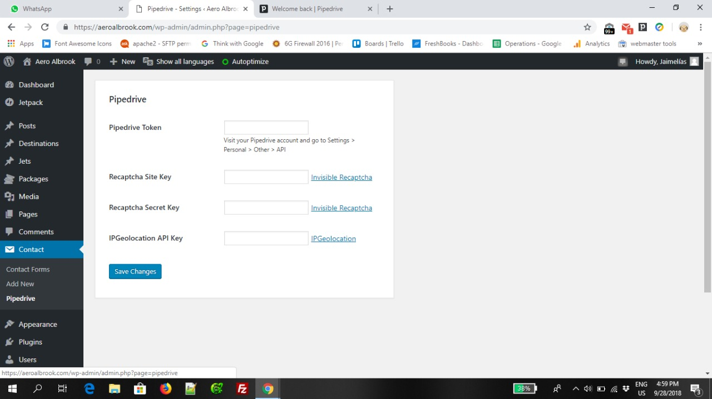
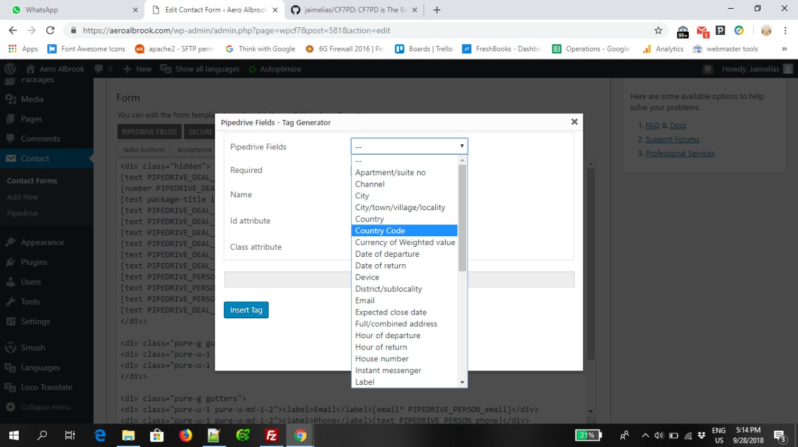
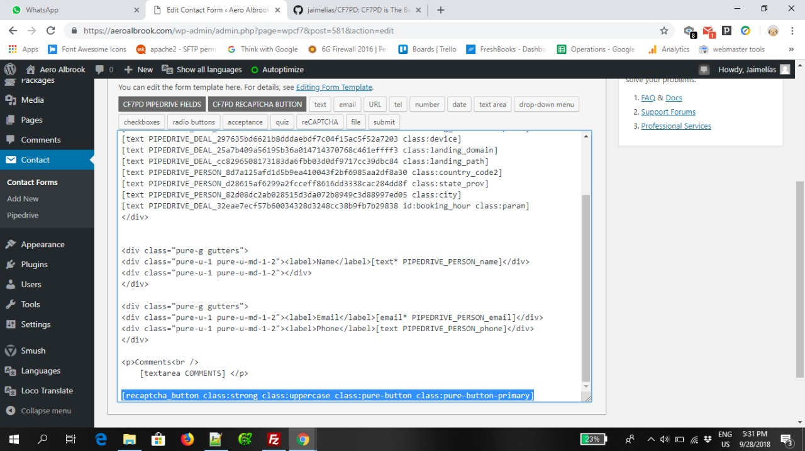

# CF7PD is the best Marketing Optimized Wordpress integration plugin for Pipedrive

CF7PD is the best Marketing Optimized Wordpress integration plugin for Pipedrive.

CF7PD allows you to create deals, contacts and notes from a single contact form.

CF7PD supports custom fields.

CF7PD lets you track conversions from digital marketing campaigns in Pipedrive: 

- Google Ads, Bing Ads
- Social Networks (Facebook, Twitter and Instagram)
- Organic SEO (Google, Bing, Yahoo, Yandex, Baidu)
- Email Marketing Campaigns

CF7PD lets you send any data from the HTML or the URL params to Pipedrive.

## Configuration

### 1. CF7PD Settings Page



### 2. CF7PD Pipedrive Fields

Open or create a new form. Use the "CF7PD Pipedrive Fields" button to insert your Pipedrive fields. 



### 3. Replace all your [submit] tags with the new and secure [recaptcha_button] tag.

This tag supports custom value and classes. It is located next to the Pipedrive Fields button. Make sure you delete any previous [recaptcha] tag.



CF7PD use Cookies to store key decision making data until the form is submitted. This Cookie expires 30 days after it is created.

- Landing page path
- Domain name
- Device type: mobile or desktop
- Language
- Number of visits
- Number of pages visited
- Total time of site (total  visits)
- Time on site (last visit)

CF7PD is integrated with Google's Invisible reCAPTCHA. [Get Your Site Key and Secret Key](https://www.google.com/recaptcha/admin). It is required to replace all  your [submit] tags in your forms with [recaptcha_button].

## User Input Class Selectors

### Date Picker [Pikadate.js](http://amsul.ca/pickadate.js/date/):
- tag: text
- name: any custom field from Pipedrive
- class: datepicker
- example:

```[text name=PIPEDRIVE_DEAL_0000 class:datepicker]```

### Time Picker Picker [Pikadate.js](http://amsul.ca/pickadate.js/date/):

Available languages: DE, ES, ES, FR, IT, JA

- tag: text
- name: any custom field from Pipedrive
- class: timepicker
- example:

```[text name=PIPEDRIVE_DEAL_0000 class:timepicker]```
 
## Country Code List Dropdown: 

Available languages: DE, ES, ES, FR, IT, JA

- tag: select
- name: any custom field from Pipedrive
- class: countrylist
- example: 

```[select name=PIPEDRIVE_PERSON_0000 class:countrylist]```


## Hidden Input Class Selectors

We recommend to hide all you hidden Pipedrive INPUTS in a HTML DIV tag: 

```<div style="display: hidden"><input /><input /><input /></div>```

### Landing Channel

The result can be NULL or the referral channel (Organic, Google Ads, Bing Ads, Instagram, Facebook, Twitter).

- tag: text
- name: any custom field from Pipedrive
- class: channel
- example: 

```[text name=PIPEDRIVE_DEAL_0000 class:channel]```

### Landing Device (Results: Mobile/Desktop)

There results can be Desktop or Mobile.

- tag: text
- name: any custom field from Pipedrive
- class: device
- example: 

```[text name=PIPEDRIVE_DEAL_0000 class:device]```

### Landing Domain

The result is the websites domain name (website main URL).

- tag: text
- name: any custom field from Pipedrive
- class: landing_domain
- example: 

```[text name=PIPEDRIVE_DEAL_0000 class:landing_domain]```

### Landing Page Path

The result is the landing page path. The first page in your website the client visited. It works only with friendly URLS.

- tag: text
- name: any custom field from Pipedrive
- class: landing_path
- example: 

```[text name=PIPEDRIVE_DEAL_0000 class:landing_path]```

### Custom URL params in Pipedrive

With this code you can track your Marketing Campaigns and any other information from the URL directly in Pipedrive.

- tag: text
- name: any custom field from Pipedrive
- class: param
- id: any param from the URL
example: 

https://example.com/?booking_date=2018-09-29&booking_hour=3%3A30+PM&booking_adults=1

```[text name=PIPEDRIVE_DEAL_0000 class:param id:booking_date]```

returns: 2018-09-29

```[text name=PIPEDRIVE_DEAL_0000 class:param id:booking_hour]```

returns: 3:30 PM

```[text name=PIPEDRIVE_DEAL_0000 class:param id:booking_adults]```

returns: 1

### HTML content in Pipedrive

Send anything from the HTML to Pipedrive. The HTML needs to be modified in order to make this code work.

- tag: text
- name: any custom field from Pipedrive
- class: id
- id: the value of the attribute data-id in your HTML
- example: 

The HTML in your Website need to include the attribute data-id="here goes the ID of your INPUT":

```<div data-id="price">500</div>```


```[text name=PIPEDRIVE_DEAL_0000 class:id id:price]```

returns: 500

### Automatic Geo-location

Send the IP, Country, State/Provice, City, District to Pipedrive automatically.

First sign up in https://app.ipgeolocation.io/auth/login

Copy the IPGeolocation API Key in the settings page of CF7PD (inside the "Contact" tab in your Wordpress dashboard).

With IPGeolocation.io You can send up to 1000 form requests with Geo-location data for free per month. Their paid plans start at $10 per month and provide 150,000 form requests.

- tag: text
- name: any custom field from Pipedrive
- class: ip, country_name, country_code2, state_prov, district, city. Form more documentation visit: https://ipgeolocation.io/documentation
- example:

```[text name=PIPEDRIVE_DEAL_0000 class:city]```

returns: the name of the city of your visitor

```[text name=PIPEDRIVE_DEAL_0000 class:country_name]```

returns: the name of the country of your visitor

```[text name=PIPEDRIVE_DEAL_0000 class:country_code2]```

returns: the 2 digits country code of your visitor